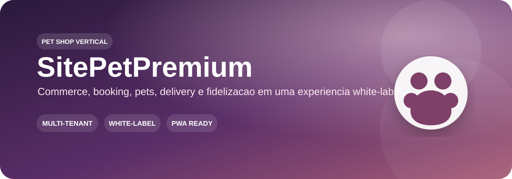
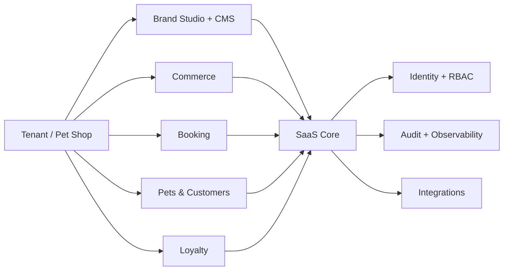

  

  
  
  

# SitePetPremium

Experiência premium para pet shops, construída para evoluir de um case visual completo para um **vertical SaaS multi-tenant, modular e white-label**. O tenant demonstrativo atual é **Amora Pet**; conteúdo de demonstração não deve ser tratado como dado de cliente em produção sem verificação.

> **Novo cliente = novo tenant + configuração.** O objetivo não é criar forks por cliente.

## ✨ Visão do produto

| 🛍️ Commerce | ✂️ Serviços & Booking | 🐾 Perfil do Pet | 🎁 Fidelização |
| --- | --- | --- | --- |
| Catálogo, busca, filtros, carrinho e checkout | Jornada de agendamento orientada a serviço, data e profissional | Multi-pets, histórico e informações de cuidado | Pontos, níveis, benefícios e campanhas por tenant |

| 🚚 Delivery & retirada | 📱 PWA | 📍 SEO local | 🎨 White-label |
| --- | --- | --- | --- |
| Regras de entrega, retirada e canais externos | Experiência instalável e mobile-first | Metadata, presença local e estrutura de descoberta | Logo, paleta, mídia, catálogo, serviços, horários e contatos por cliente |

## 🧭 Experiência do case Amora Pet

O PDF comercial é a referência visual/documental deste README e organiza o produto como uma jornada completa: **home → catálogo → produto → carrinho/checkout → serviços → agendamento → perfil do pet → fidelidade → localização**.

  <a href="docs/AMORA_PET_PROPOSTA_COMERCIAL.pdf"><strong>📄 Abrir apresentação comercial — Amora Pet</strong></a>

## 🧩 Direção SaaS

O vertical será alimentado pelo **Tupiniquim Vertical SaaS**, compartilhando tenancy, identidade/RBAC, Brand Studio, CMS, Media Manager, planos/entitlements, integrações, auditoria e observabilidade sem descaracterizar a experiência visual do pet shop.

## 🔐 Segurança e qualidade

- isolamento por tenant deve ser validado no servidor;
- autenticação não substitui autorização nem isolamento;
- uploads, formulários e endpoints caros precisam de validação e proteção contra abuso;
- secrets ficam fora do Git e do frontend;
- dados demo e produção permanecem inequivocamente separados;
- CI executa instalação travada, scripts disponíveis, TypeScript/build, audit de dependências e CodeQL;
- ausência de lint/test coverage é tratada como **release blocker**, não como PASS implícito.

## 📚 Documentação

- [Plano do vertical SaaS](docs/SAAS_VERTICAL_PLAN.md)
- [Auditoria Tupiniquim Toolbox](docs/TOOLBOX_AUDIT_2026-09-10.md)
- [Política de segurança](SECURITY.md)
- [Apresentação comercial — Amora Pet](docs/AMORA_PET_PROPOSTA_COMERCIAL.pdf)
- [Monorepo canônico — Sistema SaaS Geral](https://github.com/tupiniquimtechsolution-blip/Sistema-SaaS-Geral)

## 🚦 Estado real

O produto possui baseline funcional e visual consistente para o vertical Pet Shop. A migração para o SaaS Core deve preservar a UX atual enquanto substitui persistências e regras locais por contratos multi-tenant seguros. **Não declarar production-ready sem evidência de isolamento cross-tenant, autorização server-side, observabilidade, backup/rollback e gates verdes.**
